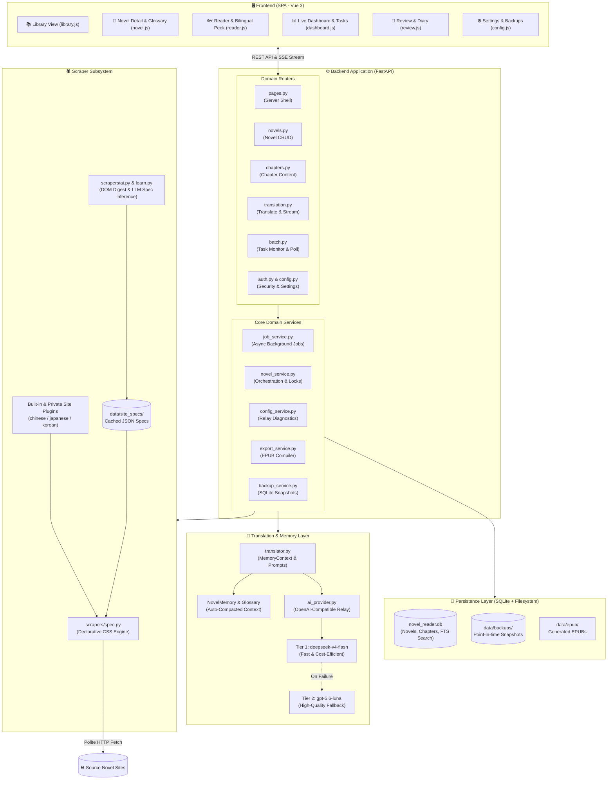
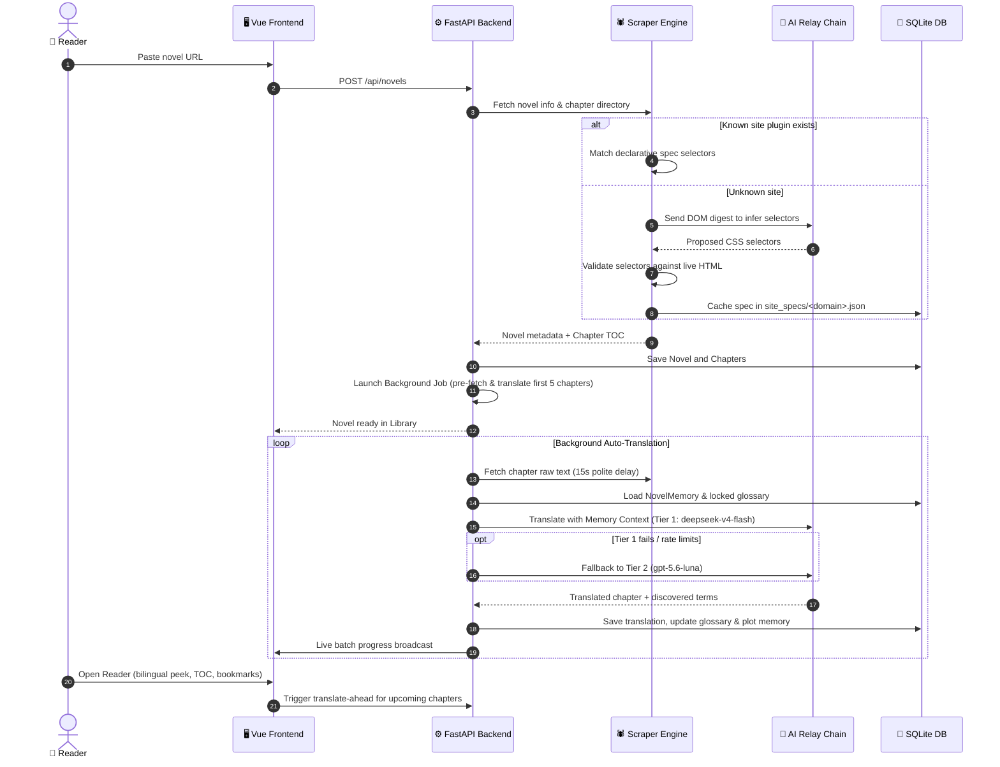

# 🐾 NyaaReader

[](LICENSE)
[](https://www.python.org/)
[](https://fastapi.tiangolo.com/)
[](https://vuejs.org/)
[](https://www.docker.com/)

> *A self-hosted web novel reader that translates your stories on the fly. Powered by a very good cat named Nyaa. Nyaa~ 🐱*

NyaaReader is a cozy, self-hosted reader for Japanese, Chinese, and Korean web novels. Paste any novel URL, and it automatically scrapes the chapters and **auto-translates them to your language** in the background — so you can binge a light novel in English (or whatever language you read in) while it quietly preps the next chapters. Runs in Docker on your own machine.

---

## 🏗️ System Architecture

NyaaReader is designed as a modular, local-first web application combining a reactive Vue 3 frontend, an asynchronous FastAPI backend, an adaptive scraping subsystem, and a memory-aware multi-tier AI translation engine.



---

### 🔄 End-to-End Workflow

Here is what happens when you add a novel or read chapters:



---

## ✨ What Nyaa Can Do

- 📖 **Multi-site scraping (declarative plugin system)** — A site plugin is a *spec*, not imperative code: you declare CSS selectors (chapter list, pagination rule, metadata, body, junk filters) and the engine in `scrapers/spec.py` handles fetching, **pagination**, de-duplication, numbering, and clean text extraction. To add a site: copy `scrapers/example_plugin.py`, set `domains`, fill in the selectors — done.
- 🤖 **Self-configuring for unknown sites** — No plugin? `AIScraper` sends the LLM a *structural digest* of the page, **validates** the selectors it proposes against that same page, and caches them as a spec in `data/site_specs/<domain>.json`. Every later fetch runs the deterministic engine with **zero LLM calls**. If the site layout changes, the spec stops validating and is re-inferred once.
- 🌐 **Two-tier AI translation, one key** — `deepseek-v4-flash` (best value) → `gpt-5.6-luna` (high quality), both on a **single** relay key. The quality tier kicks in automatically when the fast one fails.
- 🧠 **Per-novel AI memory & glossary** — Nyaa tracks characters, terms, and plot across chapters, with **auto-compaction** so novels with 500+ chapters maintain strict narrative continuity without context blowup.
- 🔒 **Editable glossary with locks** — Fix character names or terminology once and lock them. Locked terms are strictly enforced across all future chapter translations.
- 🚀 **Translate-ahead & translate-to-end** — Reading chapter 10? Chapters 11–15 quietly fetch and translate in the background. Want the full story offline? Click **Translate to end** to backfill the rest.
- 📊 **Live translation dashboard** — Real-time progress monitoring of all active background tasks, percent completion bars, current step notifications, and one-click task cancellation.
- 🎯 **Smart partial re-translation** — Updated a locked character name? Retranslate only the specific chapters that contain the modified name or drifted glossary terms, not all 500.
- 🆕 **New-chapter watcher** — `Check updates` polls the novel source for newly released chapters (politely spaced 15s apart), adds them to the catalog, and auto-queues the latest chapters for translation.
- 📚 **Reading shelves & progress** — Organize novels into *Ongoing*, *Read Later*, *Done*, and *Dropped* shelves. Track per-chapter read dots and automatically resume where you left off.
- 🖍 **Highlights & bookmarks** — Drag-select any paragraph in the reader to save a highlight with personal notes.
- 📄 **Bilingual peek** — Hover or click any translated paragraph in the reader to inspect the original raw text inline.
- 🔍 **Full-text search** — Instant search across chapter contents, notes, and glossary entries powered by SQLite FTS.
- 🎨 **Reader ergonomics** — Light, sepia, and dark themes; serif and sans-serif fonts; custom reading column width slider; fullscreen focus mode; keyboard shortcuts; touch swipe gestures; auto-hiding toolbar.
- 🔐 **Optional password lock** — Set a password in Settings to protect your instance with secure HTTP-only cookies. Leave unset for open local access.
- 💾 **Automated snapshots & backups** — Manual or recurring point-in-time SQLite snapshots with automatic cleanup.

---

## 🚀 Quick Start (Docker)

> [!NOTE]
> Requires **Docker Desktop** or Docker Engine with Docker Compose installed and running.

1. **Configure your relay key** — Create a `.env` file at the repository root:
   ```env
   FALLBACK_API_KEY=YOUR_RELAY_KEY
   ```
   *(Single key powers both `deepseek-v4-flash` and `gpt-5.6-luna` tiers).*

2. **Start NyaaReader:**
   ```bash
   docker compose up --build -d
   ```
   *(Windows users can also double-click `start.bat`).*

3. **Open in browser:**
   ```
   http://localhost:8080 🐱
   ```

4. **Add your first novel:**
   Paste any novel index page URL. If the site is unrecognized, Nyaa will inspect the page, infer the structure, validate it, and immediately start pre-translating the first chapters in the background.

---

## 🛠 Manual Run (Without Docker)

> [!TIP]
> Ensure you have **Python 3.11+** installed. `scrapers/` lives at the repo root; configure your `PYTHONPATH` accordingly.

```bash
# Clone the repository
git clone https://github.com/mughir/NyaaReader.git
cd NyaaReader

# Install dependencies
pip install -r backend/requirements.txt

# Set environment variables
export PYTHONPATH="$PWD:$PWD/backend"
export FALLBACK_API_KEY=YOUR_RELAY_KEY

# Run server
cd backend
python main.py
```
Open `http://localhost:8080` in your browser.

---

## 📁 Project Structure

```
NyaaReader/
├── backend/                        # FastAPI backend application
│   ├── main.py                     # App factory, lifespan events, middleware
│   ├── models.py                   # SQLAlchemy ORM models (Novel, Chapter, Memory, etc.)
│   ├── database.py                 # SQLite connection pooling & pragma configuration
│   ├── translator.py               # AI translation orchestrator, memory prompt injection
│   ├── ai_provider.py              # Centralized OpenAI-compatible relay client & stream handler
│   ├── security.py                 # Password hashing, token validation, rate-limiting
│   ├── views.py                    # Server-rendered HTML view wrappers
│   ├── schemas.py                  # Pydantic validation schemas
│   ├── routers/                    # Modular domain API routers
│   │   ├── auth.py                 # Authentication, health check (/api/health)
│   │   ├── batch.py                # Batch status polling, dashboard tasks (/api/dashboard/tasks)
│   │   ├── chapters.py             # Chapter content reading & manual chapter CRUD
│   │   ├── config.py               # App settings, relay health checks, backup endpoints
│   │   ├── novels.py               # Novel listing, addition, metadata, and memory routes
│   │   ├── pages.py                # Server-rendered SPA host pages (/library, /novel, /reader, /dashboard)
│   │   └── translation.py          # Translation triggers, streaming, update checks, batch actions
│   └── services/                   # Business logic services
│       ├── backup_service.py       # Snapshot creation, pruning, and restore
│       ├── config_service.py       # Configuration management & relay diagnostics
│       ├── export_service.py       # Clean EPUB compilation
│       ├── job_service.py          # Async background worker tasks with cancellation
│       └── novel_service.py        # Scraping orchestration & concurrency locks
├── frontend/                       # Static assets served by backend at /static
│   ├── library.js                  # Library view (Vue 3): shelves, search, novel cards
│   ├── novel.js                    # Novel detail (Vue 3): TOC, glossary editor, batch actions
│   ├── reader.js                   # Reader UI (Vue 3): bilingual peek, bookmarks, themes
│   ├── dashboard.js                # Task Dashboard (Vue 3): live batch jobs & cancel triggers
│   ├── review.js                   # Story review & reading diary
│   ├── config.js                   # Settings (Vue 3): API keys, model status, backups
│   ├── styles.css                  # Responsive themes & reader typography
│   └── vendor/                     # Vendored Vue 3 ESM runtime (zero external CDN dependency)
├── scrapers/                       # Scraper registry & plugin engine
│   ├── spec.py                     # Declarative selector engine (extraction & pagination)
│   ├── learn.py                    # DOM structural digest & LLM selector inference
│   ├── ai.py                       # AIScraper engine (spec cache -> inference -> text fallback)
│   ├── example_plugin.py           # Site plugin template
│   └── chinese.py / japanese.py    # Public site plugins
├── tests/                          # Comprehensive pytest test suite (175+ tests)
├── data/                           # Persistent volume directory (DB, backups, EPUBs, specs)
├── combine.py                      # Build script to overlay private plugins from vault
├── Dockerfile                      # Production container definition
├── docker-compose.yml              # Local container deployment
└── README.md                       # Project documentation
```

> [!NOTE]
> **Private Scrapers Split**: This repository represents the public NyaaReader engine. Private site plugins live in an isolated vault and can be overlaid into `scrapers/` during build time with `combine.py`.

---

## 📡 API Overview

NyaaReader provides a clean RESTful API with Server-Sent Events (SSE) for streaming:

| Method | Path | Description |
|--------|------|-------------|
| `GET`  | `/api/health` | Service health check |
| `GET`  | `/api/novels` | List all novels in library |
| `POST` | `/api/novels` | Add a new novel from URL (triggers scraper) |
| `POST` | `/api/novels/manual` | Add a novel manually without scraper |
| `GET`  | `/api/novels/{id}` | Retrieve novel details & metadata |
| `DELETE` | `/api/novels/{id}` | Delete a novel and its chapters |
| `GET`  | `/api/novels/{id}/chapters` | List chapter table of contents |
| `GET`  | `/api/novels/{id}/chapters/{n}` | Get raw and translated chapter content |
| `POST` | `/api/chapters/{id}/translate` | Translate a single chapter (memory-aware) |
| `GET`  | `/api/novels/{id}/chapters/{n}/translate/stream` | Stream translation in real-time via SSE |
| `POST` | `/api/novels/{id}/chapters/{n}/fetch` | Fetch a single chapter's content from source |
| `POST` | `/api/novels/{id}/fetch-chapters` | Fetch a range of chapters in the background |
| `POST` | `/api/novels/{id}/translate-ahead` | Queue upcoming unread raw chapters |
| `POST` | `/api/novels/{id}/translate-to-end` | Translate all remaining chapters in the novel |
| `POST` | `/api/novels/{id}/translate-titles` | Translate missing chapter titles |
| `POST` | `/api/novels/{id}/translate-meta` | Translate novel title and synopsis |
| `POST` | `/api/novels/{id}/retranslate` | Full re-translation of translated chapters |
| `POST` | `/api/novels/{id}/retranslate-drift`| Retranslate chapters with outdated glossary terms |
| `POST` | `/api/novels/{id}/retranslate-match`| Retranslate chapters containing a specific phrase |
| `POST` | `/api/novels/{id}/retry-failed` | Retry all failed chapter translations |
| `POST` | `/api/novels/{id}/check-updates` | Check source website for newly published chapters |
| `POST` | `/api/novels/{id}/batch-stop` | Request running background task to stop gracefully |
| `GET`  | `/api/novels/{id}/batch-status` | Poll progress of a specific novel's active job |
| `GET`  | `/api/dashboard/tasks` | Get all active jobs, recent tasks, and novel status |
| `GET`  | `/api/novels/{id}/memory` | Retrieve AI memory (characters, glossary, plot arcs) |
| `PUT`  | `/api/novels/{id}/memory` | Update glossary entries and locked terms |
| `GET`  | `/api/novels/{id}/progress` | Get current reading position |
| `POST` | `/api/novels/{id}/progress` | Update reading position |
| `PUT`  | `/api/novels/{id}/reading-status` | Set shelf: `ongoing`, `read_later`, `done`, `dropped` |
| `GET`  | `/api/novels/{id}/bookmarks` | List highlights & bookmarks |
| `POST` | `/api/chapters/{id}/bookmarks` | Save paragraph highlight with notes |
| `DELETE`| `/api/bookmarks/{id}` | Delete a bookmark |
| `POST` | `/api/novels/{id}/search` | Full-text search across translated chapters |
| `GET`  | `/api/novels/{id}/export/epub` | Compile and download novel as an EPUB |
| `GET`  | `/api/stats` | Library-wide reading & translation statistics |
| `GET`  | `/api/config/relay-health` | Diagnostic ping to configured AI model relay |

Interactive Swagger API documentation is available at `http://localhost:8080/docs`.

---

## 🧠 Translation Chain & AI Memory

### Dual-Tier Model Relay
NyaaReader uses an OpenAI-compatible relay architecture requiring only a single API key:
- **Tier 1 (Fast & Cost-Efficient):** `deepseek-v4-flash` — Default model (~$0.00085 / chapter). Fast turnaround for fluid reading.
- **Tier 2 (High-Fidelity Fallback):** `gpt-5.6-luna` — Automatically kicks in if Tier 1 encounters rate limits, errors, or complexity failure.

Configured in your `.env` or Settings UI:
```env
FALLBACK_BASE_URL=https://opencode.ai/zen/go/v1
FALLBACK_API_KEY=your_key_here
FALLBACK_MODEL=deepseek-v4-flash
FALLBACK_MODEL_2=gpt-5.6-luna
```

### Context Compaction
As a story grows past hundreds of chapters, Nyaa maintains a structured `MemoryContext`:
1. **Mandatory Locked Glossary**: Terms you've locked never drift.
2. **Dynamic Character & Worldbuilding Knowledge**: Learned terminology is merged without duplicates.
3. **Rolling Arc Summaries**: Older chapters are distilled into compact narrative notes, ensuring the model never exceeds its context window.

---

## 💾 Backups & Disaster Recovery

Your entire library — novels, chapters, reading progress, AI memory, and bookmarks — lives in a single SQLite database file: `data/novel_reader.db`.

Access **Settings → Backups** in the UI to manage snapshots:

| Feature | Description |
|---|---|
| **Manual Snapshot** | Click `💾 Backup now` for an instant point-in-time copy in `data/backups/`. |
| **Scheduled Backups** | Enable automated hourly/daily backups with automatic pruning of older snapshots. |
| **One-Click Download** | Download any `.db` snapshot directly to your local computer. |
| **Restoration** | Stop the container, replace `data/novel_reader.db` with your backup copy, and restart. |

---

## 📄 License

Released under the [MIT License](LICENSE). You are free to use, modify, and distribute this software, provided that credit and copyright attribution are maintained to the original repository (`https://github.com/mughir/NyaaReader`). See `LICENSE` for details.

---

*NyaaReader is an independent open-source reader created for personal reading convenience. Please respect the terms of service of source sites and support web novel authors. Nyaa~ 🐾*
